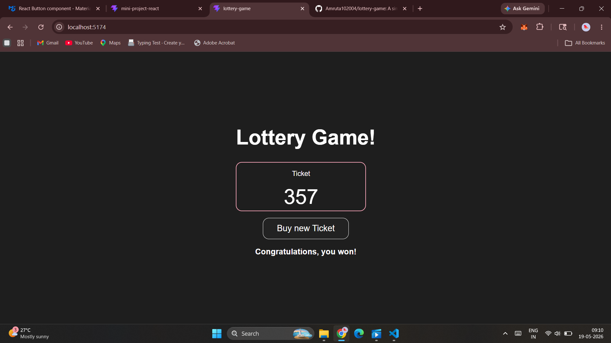

# 🎰 React Lottery Game

A simple and interactive Lottery Game built using React.  
This project demonstrates core React concepts like components, props, state management, and event handling.

---

## 📌 Project Overview

This application generates a random lottery ticket with digits.  
Each time the user clicks **"Buy New Ticket"**, a new ticket is generated.

If the sum of the digits matches the predefined winning condition, the user wins 🎉

---

## 🎯 Features

- 🎲 Random ticket generation
- 🔢 Dynamic display of ticket numbers
- 🧠 Winning condition based on sum logic
- 🔁 Button to generate new tickets
- ⚡ Instant UI updates using React state

---

## ⚙️ Tech Stack

- React (Functional Components)
- JavaScript (ES6)
- CSS (Styling)

---

## 🧠 React Concepts Used

### 1. Components
- `App` – Root component  
- `Lottery` – Main game logic  
- `Ticket` – Displays ticket  
- `TicketNum` – Displays individual number  

---

### 2. Props
- Passing data between components  
- Example:  
  - `Lottery → Ticket`  
  - `Ticket → TicketNum`  

---

### 3. useState Hook

Used to manage ticket state:

```js
let [ticket, setTicket] = useState(genTicket(n));
```
## 📂 Project Structure

```bash
react-lottery-game/
src/
│── App.jsx
│── Lottery.jsx
│── Ticket.jsx
│── TicketNum.jsx
│── helper.js
│── App.css
│── Ticket.css
│── TicketNum.css
```
## 📸 Screenshot

<p align="center">
  
</p>
